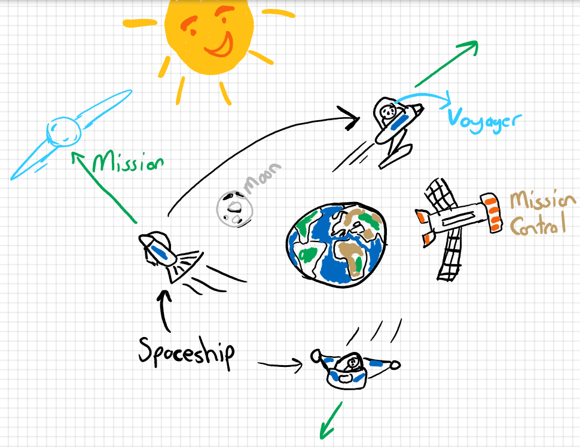

# Effective Engine - Bir Uzay Macerası

Haftasonu sıkılan .Net geliştiricisi için eğlencelik bir Web API kodlaması düşündüm. Şirket içi eğitimlerde bir WebAPI'ye ihtiyaç duyduğumuz durumlar için güzel olabilir. Kobay bir Web API'miz olur ya hani hep. İşte onun için güzel bir senaryo olabileceğini düşünüyorum. Senaryoyu aşağıdaki gibi çizmeye çalıştım.



Gelecekte geçen bir zaman diliminde galaksinin uzak diyarlarını keşfetmek üzere Uzay Yolu'nu izlemiş mürettabattan oluşan gemiler vardır. Güneşin ve ayın konumuzla bir alakası yok ama kompozisyonu tamamlarlar diye düşündüm. Bir uzay gemisi _(Spaceship)_  içinde en az 2 en fazla 7 mürettebat _(Voyager)_ olabilir. Mürettebat görev kontrolün _(MissionControl)_ uygun gördüğü gömüyle bir göreve _(Mission)_ çıkar. Her görev tek bir gemiyle ilişkilendirilir. Görevin başlatılması için bir adının olması, kendilerine has takma isimleri olan mürettebatın bulunması, bir görev süresinin verilmesi, bir gemiyle görevin ilişkilendirilmesi yeterlidir. Senaryo tarafınızca istenildiği gibi genişletilebilir.

Ben senaryoyu aşağıdaki şekilde ele aldım.

## 0 - Başlangıç
 
```bash
# Bir Solution oluşturdum
dotnet new sln -o GalaxyExplorer

# Sonra Voyager, Spaceship ve Mission olarak adlandırdığım nesneler için Entity ile DbContext'in duracağı bir class library oluşturup solution'a ekledim.
cd GalaxyExplorer
dotnet new classlib -o GalaxyExplorer.Entity
dotnet sln add .\GalaxyExplorer.Entity\GalaxyExplorer.Entity.csproj

# EntityFrameworkCore kullanacağım için birde gerekli paketi ekledim
cd GalaxyExplorer.Entity
dotnet add package Microsoft.EntityFrameworkCore -v 5.0.6
```

## 1 - Entity Sınıflarının İnşası

Uzay gemilerini Spaceship sınıfı ile işaret edeceğim. Adı ve ışık yılı olarak gidebileceği mesafeyi taşıması yeterli.

```csharp
namespace GalaxyExplorer.Entity
{
    public class Spaceship
    {
        public int SpaceshipId { get; set; }
        public string Name { get; set; }
        public double Range { get; set; }
        public int MissionId { get; set; }
    }
}
```

Mürettebatı ise Voyager olarak tanımlamıştım. Şimdişik aşağıdaki gibi kullanacağım. Kaşifin adı, rütbesi ve ilk görev tarih olsun yeterli.

```csharp
using System;

namespace GalaxyExplorer.Entity
{
    public class Voyager
    {
        public int VoyagerId { get; set; }
        public string Name { get; set; }
        public string Grade { get; set; }
        public DateTime FirstMissionDate { get; set; }
        public int MissionId { get; set; }
    }
}
```

Bir görev söz konusu. Bunu Mission sınıfı ile temsil edeceğim. Bir görev bir gemiyle ilişkili olmalı. Ayrıca bir göreve birden fazla mürettebat dahil olabilmeli.

```csharp
using System;
using System.Collections.Generic;

namespace GalaxyExplorer.Entity
{
    public class Mission
    {
        public int MissionId { get; set; }
        public int SpaceshipId { get; set; }
        public string Name { get; set; }
        public int PlannedDuration { get; set; }
        public DateTime StartDate { get; set; }
        public IEnumerable<Voyager> Voyagers { get; set; }
    }
}
```