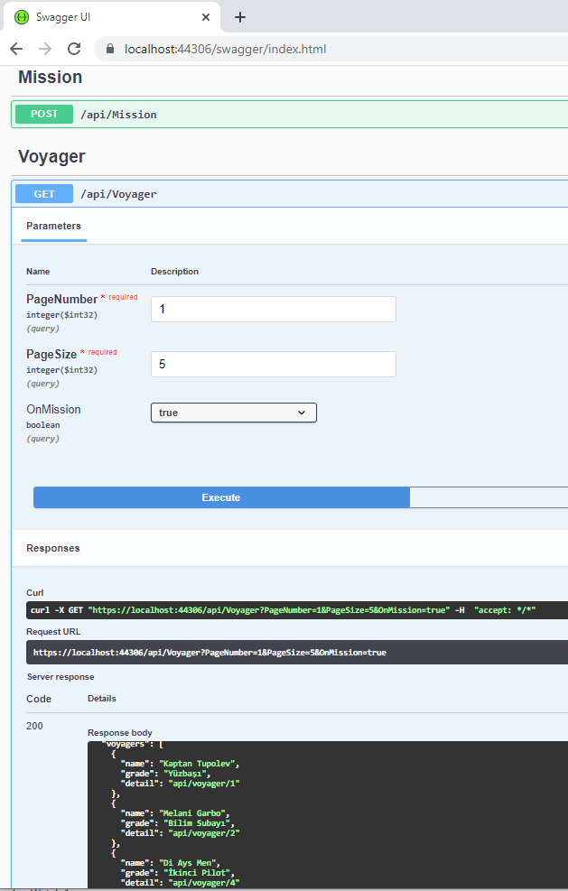
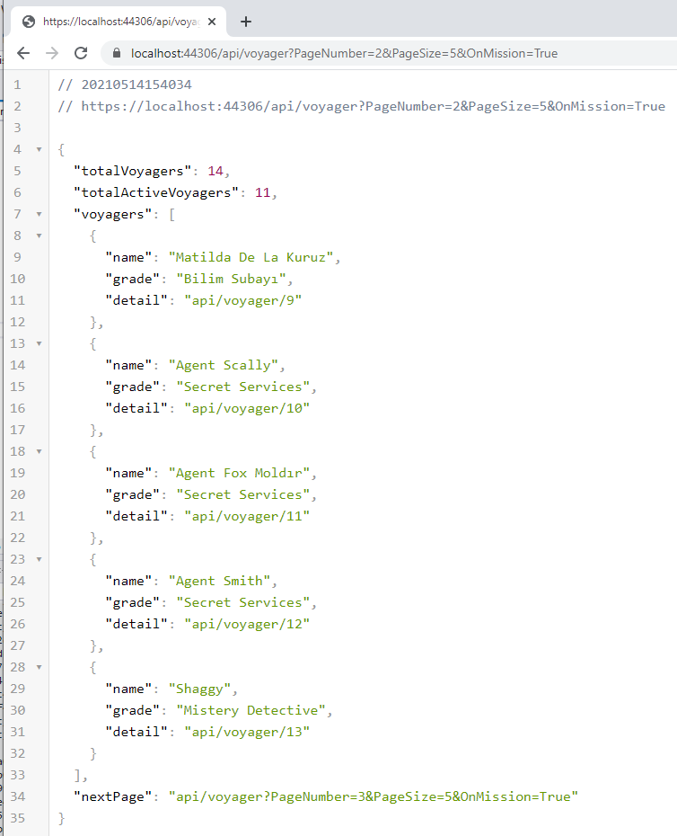

# Effective Engine - Bir Uzay Macerası

Haftasonu sıkılan .Net geliştiricisi için eğlencelik bir Web API kodlaması düşündüm. Şirket içi eğitimlerde bir WebAPI'ye ihtiyaç duyduğumuz durumlar için güzel olabilir. Kobay bir Web API'miz olur ya hani hep. İşte onun için güzel bir senaryo olabileceğini düşünüyorum. Senaryoyu aşağıdaki gibi çizmeye çalıştım.


Gelecekte geçen bir zaman diliminde galaksinin uzak diyarlarını keşfetmek üzere Uzay Yolu'nu izlemiş mürettabattan oluşan gemiler vardır. Güneşin ve ayın konumuzla bir alakası yok ama kompozisyonu tamamlarlar diye düşündüm. Bir uzay gemisi _(Spaceship)_  içinde en az 2 en fazla 7 mürettebat _(Voyager)_ olabilir. Mürettebat görev kontrolün _(MissionControl)_ uygun gördüğü gömüyle bir göreve _(Mission)_ çıkar. Her görev tek bir gemiyle ilişkilendirilir. Görevin başlatılması için bir adının olması, kendilerine has takma isimleri olan mürettebatın bulunması, bir görev süresinin verilmesi, bir gemiyle görevin ilişkilendirilmesi yeterlidir. Senaryo tarafınızca istenildiği gibi genişletilebilir.

Ben senaryoyu aşağıdaki şekilde ele aldım.

## 0 - Başlangıç
 
```bash
# Bir Solution oluşturdum
dotnet new sln -o GalaxyExplorer

# Sonra Voyager, Spaceship ve Mission olarak adlandırdığım nesneler için Entity ile DbContext'in duracağı bir class library oluşturup solution'a ekledim.
cd GalaxyExplorer
dotnet new classlib -o GalaxyExplorer.Entity
dotnet sln add .\GalaxyExplorer.Entity\GalaxyExplorer.Entity.csproj

# EntityFrameworkCore kullanacağım için birde gerekli paketi ekledim
cd GalaxyExplorer.Entity
dotnet add package Microsoft.EntityFrameworkCore -v 5.0.6
```

## 1 - Entity Sınıflarının İnşası

Uzay gemilerini Spaceship sınıfı ile işaret edeceğim. Adı ve ışık yılı olarak gidebileceği mesafeyi taşıması yeterli.

```csharp
namespace GalaxyExplorer.Entity
{
    public class Spaceship
    {
        public int SpaceshipId { get; set; }
        public string Name { get; set; }
        public double Range { get; set; }
        public bool OnMission { get; set; }
        public int MaxCrewCount { get; set; }
    }
}
```

Mürettebatı ise Voyager olarak tanımlamıştım. Şimdişik aşağıdaki gibi kullanacağım. Kaşifin adı, rütbesi ve ilk görev tarih olsun yeterli.

```csharp
using System;

namespace GalaxyExplorer.Entity
{
    public class Voyager
    {
        public int VoyagerId { get; set; }
        public string Name { get; set; }
        public string Grade { get; set; }
        public DateTime FirstMissionDate { get; set; }
        public int MissionId { get; set; }
        public bool OnMission { get; set; }
    }
}
```

Bir görev söz konusu. Bunu Mission sınıfı ile temsil edeceğim. Bir görev bir gemiyle ilişkili olmalı. Ayrıca bir göreve birden fazla mürettebat dahil olabilmeli.

```csharp
using System;
using System.Collections.Generic;

namespace GalaxyExplorer.Entity
{
    public class Mission
    {
        public int MissionId { get; set; }
        public int SpaceshipId { get; set; }
        public string Name { get; set; }
        public int PlannedDuration { get; set; }
        public DateTime StartDate { get; set; }
        public IEnumerable<Voyager> Voyagers { get; set; }
    }
}
```

## 2 - DbContext Sınıfının Yazılması

GalaxyExplorerDbContext sınıfını aşağıdaki gibi yazmaya karar verdim.

```csharp
using Microsoft.EntityFrameworkCore;

namespace GalaxyExplorer.Entity
{
    public class GalaxyExplorerDbContext
        : DbContext
    {
        public GalaxyExplorerDbContext(DbContextOptions options)
            : base(options)
        {
        }

        public DbSet<Spaceship> Spaceships { get; set; }
        public DbSet<Voyager> Voyagers { get; set; }
        public DbSet<Mission> Missions { get; set; }
        protected override void OnModelCreating(ModelBuilder modelBuilder)
        {
            modelBuilder.Entity<Mission>().HasMany(m => m.Voyagers).WithOne();

            modelBuilder.Entity<Spaceship>().HasData(
                new Spaceship
                {
                    SpaceshipId=1,
                    Name = "Saturn IV Rocket",
                    OnMission = false,
                    Range = 1.2,
                    MaxCrewCount=2
                },
                new Spaceship
                {
                    SpaceshipId = 2,
                    Name = "Pathfinder",
                    OnMission = true,
                    Range = 2.6,
                    MaxCrewCount = 5
                },
                new Spaceship
                {
                    SpaceshipId = 3,
                    Name = "Event Horizon",
                    OnMission = false,
                    Range = 9.9,
                    MaxCrewCount = 3
                },
                new Spaceship
                {
                    SpaceshipId = 4,
                    Name = "Captain Marvel",
                    OnMission = false,
                    Range = 3.14,
                    MaxCrewCount = 7
                },
                new Spaceship
                {
                    SpaceshipId = 5,
                    Name = "Lucky Tortiinn",
                    OnMission = false,
                    Range = 7.7,
                    MaxCrewCount = 7
                },
                new Spaceship
                {
                    SpaceshipId = 6,
                    Name = "Battle Master",
                    OnMission = false,
                    Range = 10,
                    MaxCrewCount = 5
                },
                new Spaceship
                {
                    SpaceshipId = 7,
                    Name = "Zerash Guidah",
                    OnMission = true,
                    Range = 3.35,
                    MaxCrewCount = 3
                },
                new Spaceship
                {
                    SpaceshipId = 8,
                    Name = "Ayran Hayd",
                    OnMission = false,
                    Range = 5.1,
                    MaxCrewCount = 4
                },
                new Spaceship
                {
                    SpaceshipId = 9,
                    Name = "Nebukadnezar",
                    OnMission = false,
                    Range = 9,
                    MaxCrewCount = 7
                },
                new Spaceship
                {
                    SpaceshipId = 10,
                    Name = "Sifiyus Alpha Siera",
                    OnMission = false,
                    Range = 7.7,
                    MaxCrewCount = 7
                }
            );
        }
    }
}
```

## 3 - DTO Tipleri için Bir Kütüphane Oluşturulması

Görev kontrol tarafına sadece bir başlatma emri gelsin istiyorum. Görevin adı, katılacak mürettebatın adları gib az sayıda bilgi. Entity türlerini doğrudan API üzerinden açmak yerine bir ViewModel üstünden sadece aksiyona özgü verileri almak niyetindeyim. O yüzden Data Transfer Object tipleri kullanacağım.

```bash
# DTO Projesini açtım
dotnet new classlib -o GalaxyExplorer.DTO

# ve Solution'a ekledim
dotnet sln add .\GalaxyExplorer.DTO\GalaxyExplorer.DTO.csproj
```

Sonrasında yeni bir görev başlatmak için kullanacağım aşağıdaki DTO sınıflarını ekledim.

Göreve katılacak mürettebat için.

```csharp
using System.ComponentModel.DataAnnotations;

namespace GalaxyExplorer.DTO
{
    public class VoyagerRequest
    {
        [Required]
        [MinLength(3)]
        [MaxLength(25)]
        public string Name { get; set; }
        [Required]
        public string Grade { get; set; }
    }
}
```

Görevin kendisi için. En az iki en fazla 7 mürettebat olabilen bir görev. Gemi ataması havuzdaki müsait olanlardan yapılacak. Bu yüzden görev gemisi ile ilgili bir bilgi eklemedim.

```csharp
using System;
using System.Collections.Generic;
using System.ComponentModel.DataAnnotations;

namespace GalaxyExplorer.DTO
{
    public class MissionStartRequest
    {
        [Required]
        [MinLength(10)]
        [MaxLength(50)]
        public string Name { get; set; }
        [Required]
        [Range(12,24)] // En az 12 en fazla 24 aylık görev olabilir
        public int PlannedDuration { get; set; }
        [Required]
        [MinLength(2)]
        [MaxLength(7)] //Minimum 2 maksimum 7 mürettebat olsun diye
        public List<VoyagerRequest> Voyagers { get; set; }
    }
}
```

Görevi başlatma sırasında oluşacak hatalar ile ilgili de belki bir response türü iyi olabilirmiş.

```csharp
namespace GalaxyExplorer.DTO
{
    public class MissionStartResponse
    {
        public bool Success { get; set; }
        public string Message { get; set; }
    }
}
```

## 4 - Servis Bileşenleri için Kütüphane Eklenmesi

Web API haricinde buradaki kurguyu farklı bir ortamda da kullanmak isteyebilirim. Controller'ın kullanacağı Entity Framework işleri başka bir kütüphaneye alsam güzel olabilir. Hatta servisleştirirsem daha iyi. Böylece Dependency Injection ile eklemem de kolay olur. Önce bir kütüphane oluşturayım ve gerekli projeleri referans edeyim.

```bash
# Projeyi oluştur
dotnet new classlib -o GalaxyExplorer.Service
# Solution'a ekle
dotnet sln add .\GalaxyExplorer.Service\GalaxyExplorer.Service.csproj
# Proje içine gir
cd .\GalaxyExplorer.Service
# DTO projesini referans et
dotnet add reference ..\GalaxyExplorer.DTO\GalaxyExplorer.DTO.csproj

# DbContext'e ihtiyacım olacak.
dotnet add reference ..\GalaxyExplorer.Entity\GalaxyExplorer.Entity.csproj
```

Önce soyutlamayı sağlayacak arayüz tipini ekledim.

```csharp
using GalaxyExplorer.DTO;
using System.Threading.Tasks;

namespace GalaxyExplorer.Service
{
    public interface IMissionService
    {
        Task<MissionStartResponse> StartMissionAsync(MissionStartRequest request);
    }
}
```

Sonra asıl işi yapan _(Concrete)_ sınıfı yazdım.

```csharp
using GalaxyExplorer.DTO;
using GalaxyExplorer.Entity;
using System;
using System.Collections.Generic;
using System.Linq;
using System.Threading.Tasks;

namespace GalaxyExplorer.Service
{
    public class MissionService
        : IMissionService
    {
        private readonly GalaxyExplorerDbContext _dbContext;
        // Servisi kullanan uygulamanın DI Container Service Registery'si üzerinden gelecektir.
        // O anki opsiyonları ile birlikte gelir. SQL olur, Postgresql olur, Mongo olur bilemiyorum.
        // Entity modelin uygun düşen bir DbContext gelecektir.
        public MissionService(GalaxyExplorerDbContext dbContext)
        {
            _dbContext = dbContext;
        }
        public async Task<MissionStartResponse> StartMissionAsync(MissionStartRequest request)
        {
            using var transaction = await _dbContext.Database.BeginTransactionAsync(); // Transaction başlatalım
            try
            {
                // Mürettebat sayısı uygun olup aktif görevde olmayan bir gemi bulmalıyız. Aday havuzunu çekelim.
                var crewCount = request.Voyagers.Count;
                var candidates = _dbContext.Spaceships.Where(s => s.MaxCrewCount >= crewCount && s.OnMission == false).ToList();
                if (candidates.Count > 0)
                {
                    Random rnd = new();
                    var candidateId = rnd.Next(0, candidates.Count);
                    var ship = candidates[candidateId]; // Index değerine göre rastgele bir tanesini alalım

                    ship.OnMission = true;
                    await _dbContext.SaveChangesAsync(); // Gemiyi görevde durumuna alalım

                    // Görev nesnesini oluşturalım
                    Mission mission = new Mission
                    {
                        Name = request.Name,
                        PlannedDuration = request.PlannedDuration,
                        SpaceshipId = ship.SpaceshipId, // Gemi ile ilişkilendirdik
                        StartDate = DateTime.Now
                    };
                    await _dbContext.Missions.AddAsync(mission);
                    await _dbContext.SaveChangesAsync(); // Görev nesnesini db'ye yollayalım

                    // Gelen gezginlerin listesini dolaşıp
                    var voyagers = new List<Voyager>();
                    foreach (var v in request.Voyagers)
                    {
                        Voyager voyager = new Voyager // Her biri için bir Voyager nesnesi örnekleyelim
                        {
                            Name = v.Name,
                            Grade = v.Grade,
                            OnMission = true,
                            MissionId = mission.MissionId // Görevle ilişkilendirdik
                        };
                        voyagers.Add(voyager);
                    }
                    await _dbContext.Voyagers.AddRangeAsync(voyagers); // Bunları topluca Voyagers listesine ekleyelim
                    await _dbContext.SaveChangesAsync(); // Değişiklikleri kaydedelim.
                    await transaction.CommitAsync(); // Transaction'ı commit edelim

                    return new MissionStartResponse
                    {
                        Success = true,
                        Message = "Görev başlatıldı."
                    };
                }
                else // Müsait veya uygun gemi yoksa burda durmamızın anlamı yok
                {
                    await transaction.RollbackAsync();

                    return new MissionStartResponse
                    {
                        Success = false,
                        Message = "Şu anda görev için müsait gemi yok"
                    };
                }                
            }
            catch (Exception exp)
            {
                await transaction.RollbackAsync();
                return new MissionStartResponse
                {
                    Success = false,
                    Message = $"Sistem Hatası:{exp.Message}"
                };
            }
        }
    }
}
```

## 5 - Sırada Controller var. Yani Web API

Önce projeyi oluşturup gerekli paketleri ekledim.

```bash
# Web API projesini oluştur
dotnet new webapi -o GalaxyExplorer.API
# Solution'a ekle
dotnet sln add .\GalaxyExplorer.API\GalaxyExplorer.API.csproj
# Proje klasörüne geç
cd .\GalaxyExplorer.API
# EntityFrameworkCore paketini ekle
dotnet add package Microsoft.EntityFrameworkCore -v 5.0.6
# Local SQL kullanmak istedim. Onun paketini ekle
dotnet add package Microsoft.EntityFrameworkCore.SqlServer -v 5.0.6
# Migration için gerekli olacak paket
dotnet add package Microsoft.EntityFrameworkCore.Design -v 5.0.6

# WeatherForecast* tiplerini sildim

# Service ve DTO projelerini referasn ettim
dotnet add reference ..\GalaxyExplorer.Service\GalaxyExplorer.Service.csproj
dotnet add reference ..\GalaxyExplorer.DTO\GalaxyExplorer.DTO.csproj
dotnet add reference ..\GalaxyExplorer.Entity\GalaxyExplorer.Entity.csproj
```

Startup.cs içerisindeki ConfigureServices metodunu aşağıdaki hale getirdim.

```csharp
public void ConfigureServices(IServiceCollection services)
{
    // DI serivslerine DbContext türevini ekliyoruz. 
    services.AddDbContext<GalaxyExplorerDbContext>(options =>
    {
        // SQL Server baz alınacak ve appsettings.json'dan GalaxyDbConnStr ile belirtilen bağlantı bilgisi kullanılacak.
        options.UseSqlServer(Configuration.GetConnectionString("GalaxyDbConnStr"), b => b.MigrationsAssembly("GalaxyExplorer.API"));
    });
    services.AddControllers();
    services.AddSwaggerGen(c =>
    {
        c.SwaggerDoc("v1", new OpenApiInfo { Title = "GalaxyExplorer.API", Version = "v1" });
    });
}
```

ConnectionString bilgisi ise şöyle

```json
"ConnectionStrings": {
      "GalaxyDbConnStr": "Data Source=(localdb)\\MSSQLLocalDB;Initial Catalog=GalaxyExplorer;Integrated Security=True"
    }
```

Ardından Controller sınıfını aşağıdaki gibi geliştirdim.

```csharp
using GalaxyExplorer.DTO;
using GalaxyExplorer.Service;
using Microsoft.AspNetCore.Mvc;
using System.Threading.Tasks;

namespace GalaxyExplorer.API.Controller
{
    [Route("api/[controller]")]
    [ApiController]
    public class MissionController : ControllerBase
    {
        // DI Container'a kayıtlı IMissionService uyarlaması kimse o gelecek
        private readonly IMissionService _missionService;
        public MissionController(IMissionService missionService)
        {
            _missionService = missionService;
        }
        [HttpPost]
        public async Task<IActionResult> StartAsync([FromBody] MissionStartRequest request) // JSON Body'den request nesnesini alsın
        {
            if (!ModelState.IsValid)
                return BadRequest(); // Model validasyon kurallarında ihlal olursa

            // Servis metodunu çağıralım
            var startResult = await _missionService.StartMissionAsync(request);
            if (startResult.Success) // Sonuç başarılı ise HTTP OK
                return Ok(startResult.Message);
            else
                return BadRequest(startResult.Message); // Değilse HTTP Bad Request
        }
    }
}
```

Controller'ın IMissionService implementasyonunu kullanabilmesi içinse Startup'taki DI servisine kayıt işlemini yapmayı da ihmal etmedim.

```csharp
services.AddTransient<IMissionService, MissionService>();
```

Migration işlemleri için dotnet ef aracını kullanadım ve aşağıdaki gibi ilerledim. 

```bash
# Tool kurulumu için
dotnet tool install --global dotnet-ef
# tool'u güncellemek için
dotnet tool update --global dotnet-ef
# tool'u projede kullanmak için
dotnet add package Microsoft.EntityFrameworkCore.Design
# kurulduğunu görmek için
dotnet ef

# Aşağıdaki komutları Web API projesi içinde çalıştırdım.
dotnet ef migrations add Initial -o Db/Migrations
dotnet ef database update
```

## 6 - Testler

Web API doğrudan çalıştırılınca Swagger arayüzü karşıma çıktı. Dolayısıyla ilk testleri yapmak oldukça kolay oldu. 


Örnek bir JSON içeriğini aşağıdaki gibi uyguladım.

```json
{
  "name": "Ufuk Ötesi Macerası",
  "plannedDuration": 18,
  "voyagers": [
    {
      "name": "Kaptan Tupolev",
      "grade": "Yüzbaşı"
    },
    {
      "name": "Melani Garbo",
      "grade": "Bilim Subayı"
    },
    {
      "name": "Dursun Durmaz",
      "grade": "Seyrüseferci"
    }
  ]
}
```

Bu da gerekirse diye Curl komutu.

```bash
curl -X POST "https://localhost:44306/api/Mission" -H  "accept: */*" -H  "Content-Type: application/json" -d "{\"name\":\"Ufuk Ötesi Macerası\",\"plannedDuration\":18,\"voyagers\":[{\"name\":\"Kaptan Tupolev\",\"grade\":\"Yüzbaşı\"},{\"name\":\"Melani Garbo\",\"grade\":\"Bilim Subayı\"},{\"name\":\"Dursun Durmaz\",\"grade\":\"Seyrüseferci\"}]}"
```

Bu JSON içeriği için sonuçlar güzel.


Validasyonların çalıştığını görmek için aşağıdaki gibi bir JSON talebi denedim.

```json
{
  "name": " ",
  "plannedDuration": 10,
  "voyagers": [
    {
      "name": "The Choosen One",
      "grade": "Hacker"
    }
  ]
}
```

Buna göre şöyle bir çıktı elde ettim. Yani doğrulama kontrolleri görevini yerine getirdi.


## 7 - Ek Geliştirmeler

Temel senaryo aslında tamam ancak... 

Gezginler zaman içerisinde sayıca artacaktır. Genelde bu tip senaryolarda HTTP Get ile çağırılan fonksiyonlar tüm listeyi döndürür. Ancak satır sayısı fazla ise servisten her şeyi döndürmek iyi bir pratik olmayabilir. Bunun yerine kriter bazlı veri döndürmek daha iyi olur. Örneğin aktif görevde olan veya olmayanların listeini çekmek. Yine de bu bile fazla veri dönmesine sebebiyet verebilir. Sayfalama kriteri eklemek iyi bir çözüm olabilir. Bu sebeple Response ve Request için bazı DTO tipleri tasarladım.

Controller'ın ilgili metoduna gelecek talebin aşağıdaki sınıfa uygun olmasını istedim. Kaçıncı sayfadan itibaren kaç satır alınacağını belirttim.

```csharp
using System.ComponentModel.DataAnnotations;

namespace GalaxyExplorer.DTO
{
    public class GetVoyagersRequest
    {
        [Required]
        public int PageNumber { get; set; }
        [Required]
        [Range(5,20)] // Sayfa başına minimum 5 maksimum 20 satır kabul edelim
        public int PageSize { get; set; }
        public bool OnMission { get; set; }
    }
}
```

API metodunun dönüşünü ise aşağıdaki gibi tasarladım. Toplam gezgin sayısı, aktif görevde olan gezgin sayısı, istenen sayfa listesi ve sonraki sayfaya geçiş için yardımcı bağlantı bilgisini döndürmeyi düşündüm.

```csharp
using System.Collections.Generic;

namespace GalaxyExplorer.DTO
{
    public class GetVoyagersResponse
    {
        public int TotalVoyagers { get; set; }
        public int TotalActiveVoyagers { get; set; }
        public List<VoyagerResponse> Voyagers { get; set; }
        public string NextPage { get; set; }
    }
}
```

Bu response tipinden kullanılan listenin elemanını ise aşağıdaki gibi geliştirdim. Basit birkaç bilgi ve detaya gitmek için bir bağlantı ifadesi işe yarayabilir.

```csharp
namespace GalaxyExplorer.DTO
{
    public class VoyagerResponse
    {
        public string Name { get; set; }
        public string Grade { get; set; }
        public string Detail { get; set; }
    }
}
```

Sonrasında Servis arayüzüne yeni fonksiyon bildirimini ekledim.

```csharp
Task<GetVoyagersResponse> GetVoyagers(GetVoyagersRequest request);
```

ve eklenen yeni metodu MissionService üzerinde uyguladım.

```csharp
public async Task<GetVoyagersResponse> GetVoyagers(GetVoyagersRequest request)
{
    var currentStartRow = (request.PageNumber - 1) * request.PageSize;
    var response = new GetVoyagersResponse
    {
        // Kolaylık olsun diye sonraki sayfa için de bir link bıraktım
        // Lakin başka kayıt yoksa birinci sayfaya da döndürebiliriz
        NextPage = $"api/voyager?PageNumber={request.PageNumber + 1}&PageSize={request.PageSize}&OnMission={request.OnMission}", 
        TotalVoyagers = await _dbContext.Voyagers.CountAsync(),
        TotalActiveVoyagers = await _dbContext.Voyagers.CountAsync(v => v.OnMission == true)
    };

    var voyagers = await _dbContext.Voyagers
        .Where(v => v.OnMission == request.OnMission)
        .Skip(currentStartRow)
        .Take(request.PageSize)
        .Select(v => new VoyagerResponse
        {
            Name = v.Name,
            Grade = v.Grade,
            Detail = $"api/voyager/{v.VoyagerId}" // Bu Voyager'ın detaylarını görmek için bir sayfaya gitmek isterse diye
        })
        .ToListAsync();
    response.Voyagers = voyagers;

    return response;
}
```

Tabii bu yeni fonksiyonu kullanabilmek için Controller tarafına da müdahale etmem gerekti. Voyager ile ilgili bir işlem söz konusu olduğundan VoyagerController isimli yeni bir Controller tipi ekledim.

```csharp
using GalaxyExplorer.DTO;
using GalaxyExplorer.Service;
using Microsoft.AspNetCore.Mvc;
using System.Threading.Tasks;

namespace GalaxyExplorer.API.Controller
{
    [Route("api/[controller]")]
    [ApiController]
    public class VoyagerController : ControllerBase
    {
        // DI Container'a kayıtlı IMissionService uyarlaması kimse o gelecek
        private readonly IMissionService _missionService;
        public VoyagerController(IMissionService missionService)
        {
            _missionService = missionService;
        }
        [HttpGet]
        public async Task<IActionResult> GetVoyagers([FromQuery] GetVoyagersRequest request) // Parametreleri QueryString üzerinden almayı tercih ettim
        {
            var voyagers = await _missionService.GetVoyagers(request);
            return Ok(voyagers);
        }
    }
}
```

Uygulamayı tekrar çalıştırıp başka görevler de başlattıktan sonra Get metodunu yine Swagger arabirimi üzerinden test ettim.



```bash
# curl ile test etmek isterseniz
curl -X GET "https://localhost:44306/api/Voyager?PageNumber=1&PageSize=5&OnMission=true" -H  "accept: */*"
```

Sonuç

```json
{
  "totalVoyagers": 14,
  "totalActiveVoyagers": 11,
  "voyagers": [
    {
      "name": "Kaptan Tupolev",
      "grade": "Yüzbaşı",
      "detail": "api/voyager/1"
    },
    {
      "name": "Melani Garbo",
      "grade": "Bilim Subayı",
      "detail": "api/voyager/2"
    },
    {
      "name": "Di Ays Men",
      "grade": "İkinci Pilot",
      "detail": "api/voyager/4"
    },
    {
      "name": "Healseying",
      "grade": "Sağlık Subayı",
      "detail": "api/voyager/6"
    },
    {
      "name": "Kaptan Fasma",
      "grade": "Tugay Komutanı",
      "detail": "api/voyager/7"
    }
  ],
  "nextPage": "api/voyager?PageNumber=2&PageSize=5&OnMission=True"
}
```

Tabi sonraki sayfayı da nextPage ile gelen url'i kullanarak denedim.



## Öğrenciye Neler Yaptırılabilir?

- Voyager listesinden herbir gezginin şu ana kadar katıldığı toplam görev sayısını da döndürebiliriz.
- Voyager listesinden dönen Detail özelliğinin karşılığı olan Controller metodunu tamamlayabiliriz.
- Aktif görevler ve bu görevlerdeki gezginlerin listesini döndürecek bir fonksiyon ekletebiliriz.
- VoyagerController için MissionService yerine başka bir soyutlama yaptırılabilir _(IVoyagerService ve VoyagerService gibi)_? 
- Tamamlanan görevle ilgili güncellemeri yapacak bir PUT fonksiyonu dahil ettirilebilir. O görevin durumunu tamamlandıya çekip, göreve katılan mürettebatı yeni görev almaya uygun olarak işaretleyen bir fonksiyon olabilir. Eksik Entity alanları varsa onların fark edilmesi ve yeni bir Migration planı hazırlanıp çalıştırılması sağlanabilir.